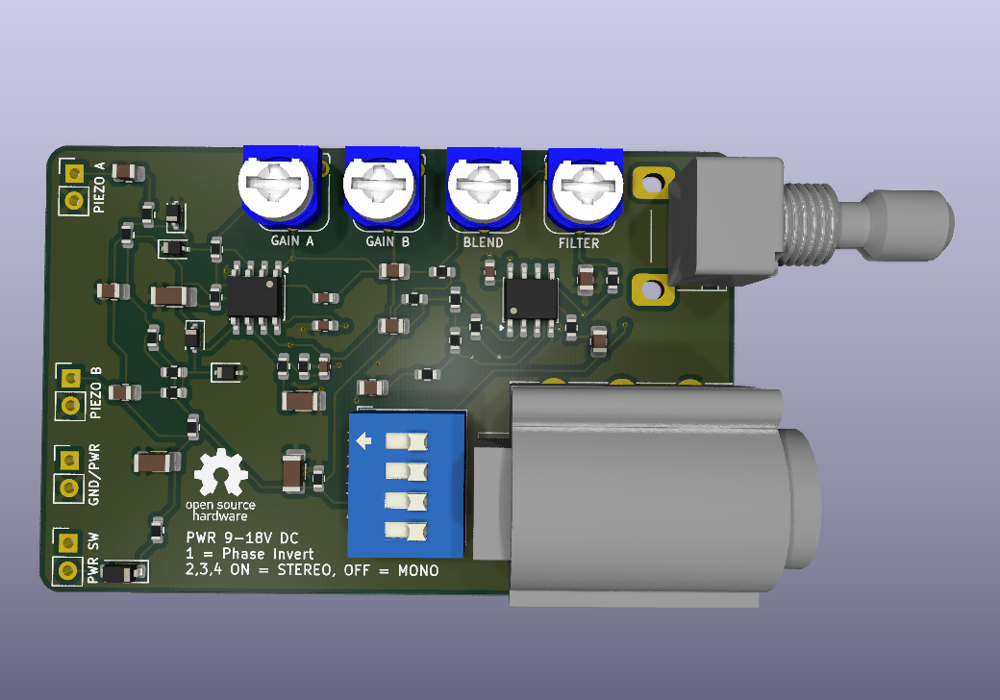

# PiezAmp

Piezos straight into pedals sound like deep fried ass, so I built this preamp. 
There's like 1000 of these circuits, but I wanted an all in one solution that you could just throw in
a noisebox and have it sound halfway decent, with some tweaks to really dial in a nice sound.

Based on Richard Mudhar's
[low-noise piezo preamp](http://www.richardmudhar.com/blog/piezo-contact-microphone-hi-z-amplifier-low-noise-version/),
doubled up and extended. 

## Features

- **Nice opamp buffered Hi-Z inputs.** Piezo discs have way too high impedance for line inputs.
  At 1 MΩ they keep their full thiccness (results may vary with piezo guitar pickups, 
  this is mainly designed for cheap discs).
- **Gain control:** ×2 to ×12 (+6 to +21.6 dB) per channel.
- **Low noise:** about −119 dBu with a 15 nF disc, inshallah.
- **Blend** between both piezos to dial in the perfect noize.
- **Phase invert:** This might help when you have two piezos in the same box so 
  they don't phase cancel eachother out.
- **Lowpass  filter** from about 27 kHz down to about 34 Hz, get rid of any remaining tinny-ness.
- **Master volume** with a 9 mm panel pot. It shoooould (?) mount in line with the output
  jack.
- **Mono or stereo output** on a TRS jack. Using it in stereo mode bypasses the
  volume and filter. I mainly did this to use with digital drum triggers, so for a basic
  noisebox setup you probably want mono.
- **Power:** 9–18 V DC, should work with a 9v battery, or with pretty much any barreljack
  adapter you have lying around.

## How it works

- I tried to annotate the schematic pretty good — see the [annotated schematic](piezamp.pdf)
- Read [Richard Mudhar's blog](http://www.richardmudhar.com/blog/piezo-contact-microphone-hi-z-amplifier-low-noise-version/) lol

## Connections

| Ref | Header / part | Pin 1 | Pin 2 | Pin 3 |
|---|---|---|---|---|
| J5 | Piezo A in | signal | GND | |
| J6 | Piezo B in | signal | GND | |
| J4 | Power in | +9–18 V | GND | |
| SW1 | Power switch (in series with +V) | from J4 | to board | |
| RV5 | Master volume (9 mm right-angle pot) | GND | wiper (out) | top |
| J3 | Output, 6.35 mm TRS | tip = mono / A | ring = B (stereo) | sleeve = GND |

The inputs are 2-pin headers. You can put jacks on em or just wire the piezos directly
to the inputs. **MAKE SURE THE BLACK LEAD** (or the one connected to the brass disc) **GOES TO GND** - polarity does, in fact matter here.

If you don't want an on/off switch, just connect the switch terminal with a piece of wire or something

## Controls

| Control | Function |
|---|---|
| Gain A / gain B | ×2 - ×12 gain,CW = more gain |
| Blend | A <-> B |
| High-cut | 27 kHz -> 34 Hz, CW = more cut |
| Master volume | CW = louder |

""Note:"" if you want to wire the filter to an external pot, you should probably use a Log taper one (1M-A). Linear is okay for trim, but the usable range is reallllly small. Same applies for the volume too, but less dramatic.

**DIP switch SW2**:

| Pos | Function | Mono | Stereo |
|---|---|---|---|
| 1 | Channel B polarity invert | either | either |
| 2 | A direct to the output buffer | OFF | ON |
| 3 | Volume bypass | OFF | ON |
| 4 | B to the ring | OFF | ON |

- **Mono:** blend -> high-cut -> volume -> tip. A TS or TRS lead works.
- **Stereo:** A -> tip, B -> ring, with no blend, filter or volume. Use a TRS
  lead.

**Setting up:** Make a loud noise, and raise each
gain until the output is just below clipping. Try flip DIP 1: whichever setting sounds nicer is
right. Then set the blend, the high-cut and the master to taste.

## Customisation

- **Trimmers to panel pots.** Any trimmer (RV1–RV4) can be replaced by a panel
  pot wired to its three pads:
  - Pot lug 1 -> pad 1, wiper -> pad 2, lug 3 -> pad 3. The board already ties
    pads 2 and 3 where the circuit needs a variable resistor.
  - Use the same resistance value as the trimmer. The exception is RV3, where
    anything from 5k to 10k works.
  - **For the high-cut (RV4), a log 1 MΩ pot is best.** It spreads
    the sweep evenly, where a linear part crams everything above 4 kHz into
    the first few degrees of rotation (sorry).
- **Jumpering trimmers to fixed settings.** Leave the trimmer out and link or
  fit parts instead:
  - **Gain, fixed:** link pads 1–2 for minimum gain (×2). For any other fixed
    gain, fit a resistor R across pads 1–2: gain = 2 + R / 1 kΩ.
  - **Blend, fixed:** link pads 2–1 for A only, or pads 2–3 for B only. For an
    equal mix, fit two equal resistors (about 2.2k), one from pad 1 to pad 2
    and one from pad 3 to pad 2.
  - **High-cut, off:** link pads 1–2. The filter is then fully open.
  - **High-cut, fixed:** fit a resistor R across pads 1–2: fc ≈ 1 / (2π · R · 4.7 nF).
    For example, 33k gives about 1 kHz.
  - **Master volume:** RV5's holes also take a 1×3 pin header for an off-board
    pot. For fixed full volume, link pads 2–3 (the same as DIP 3).
- **More headroom:** run it on 18 V. Shouldn't catch fire.
